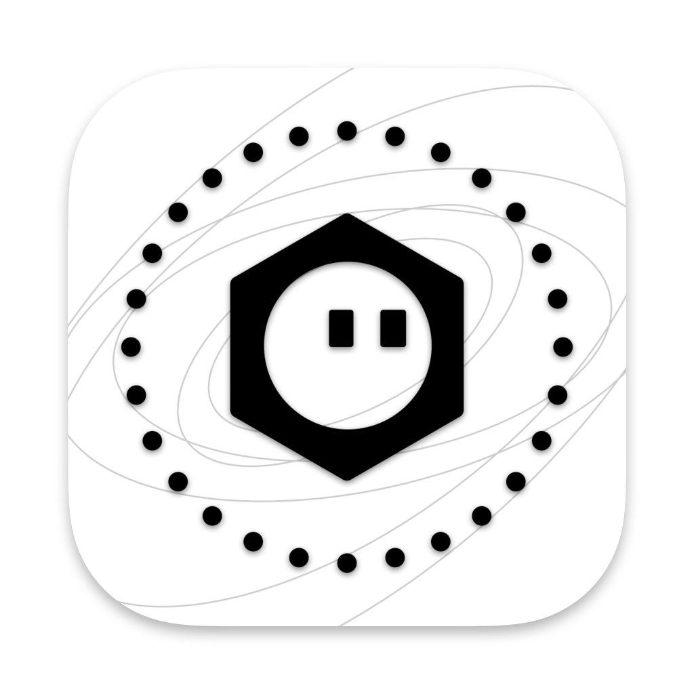
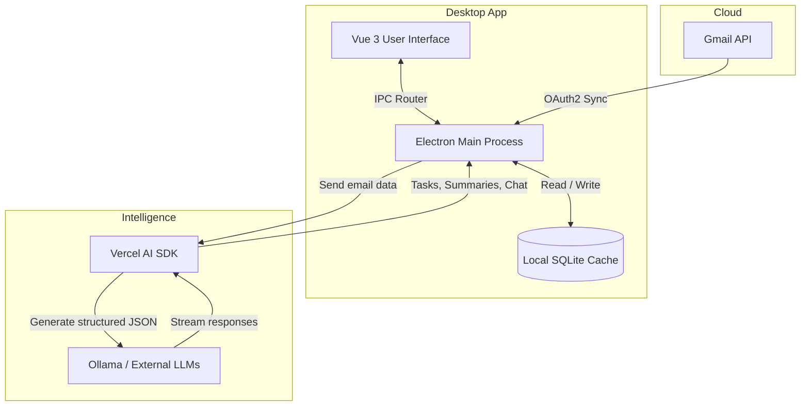

<p align="center">
  
</p>

<h1 align="center">Bubbles.mail</h1>

<p align="center">
  <strong>An intelligent, minimalist, AI-powered email client for macOS.</strong>
</p>

<p align="center">
  <a href="#features">Features</a> •
  <a href="#architecture--tech-stack">Tech Stack</a> •
  <a href="#getting-started">Getting Started</a> •
  <a href="#development">Development</a>
</p>

---

## 🫧 Overview

**Bubbles.mail** is a modern, privacy-conscious desktop email client built specifically for macOS. It reimagines your inbox by moving away from cluttered lists and replacing them with an intelligent, timeline-based **Daily Digest**. 

Integrated with the **Vercel AI SDK**, Bubbles.mail doesn't just show you emails—it reads them, understands them, and provides you with actionable tasks, upcoming deadlines, and concise summaries so you can achieve Inbox Zero with ease.

## ✨ Features

- **Daily Intelligence Digest:** A beautiful, auto-generated morning briefing that groups your emails into actionable **Tasks**, critical **Deadlines**, and ongoing **Threads**.
- **Bubbles.ai Assistant:** Chat directly with your inbox. Ask Bubbles.ai to summarize a long thread, find an old receipt, or draft a polite reply in seconds.
- **Smart Categorization:** Automatically categorizes emails into *Primary*, *Updates*, *Promotions*, *Social*, and *Forums* using native Gmail labels.
- **Multi-Account Support:** Seamlessly connect and switch between multiple Gmail accounts.
- **Gorgeous macOS UI:** A native-feeling, glassmorphic design featuring smooth animations, a unified sidebar, and deep macOS integration (including full-bleed squircle icons).
- **Fast & Local:** Emails are synced and cached locally using SQLite for instant loading and offline access.
- **On-Device AI Ready:** By leveraging tools like Ollama, Bubbles.mail can process your emails entirely on your machine. Keep your sensitive data strictly local while still enjoying the power of Large Language Models.

## 🛠 Architecture & Tech Stack

Bubbles.mail is built using web technologies packaged into a performant desktop application.



- **Framework:** [Electron](https://www.electronjs.org/) + [Vue 3](https://vuejs.org/) (Composition API)
- **Language:** [TypeScript](https://www.typescriptlang.org/)
- **Build Tool:** [Vite](https://vitejs.dev/) + [Electron-Builder](https://www.electron.build/)
- **Database:** [Better-SQLite3](https://github.com/WiseLibs/better-sqlite3) (Local caching)
- **AI Integration:** [Vercel AI SDK](https://sdk.vercel.ai/)
- **Styling:** Vanilla CSS + modern CSS variables & backdrop-filters

## 🚀 Getting Started

### Prerequisites

- macOS (Apple Silicon `arm64` or Intel `x64`)
- Node.js (v18+)
- A Google Cloud Project with the **Gmail API** enabled (for OAuth 2.0 credentials)

### Installation

1. **Clone the repository:**
   ```bash
   git clone https://github.com/yourusername/bubbles.mail.git
   cd bubbles.mail
   ```

2. **Install dependencies:**
   ```bash
   npm install
   ```

3. **Set up Environment Variables:**
   Create a `.env` file in the root directory and add your Google OAuth credentials and AI provider keys:
   ```env
   VITE_GOOGLE_CLIENT_ID=your_google_client_id
   GOOGLE_CLIENT_SECRET=your_google_client_secret
   OPENAI_API_KEY=your_openai_api_key
   ```

4. **Run in development mode:**
   ```bash
   npm run dev
   ```

## 📦 Building for Production

To package the application into a standalone macOS `.dmg` and `.app`:

```bash
npm run build:mac
```

The compiled binaries will be available in the `dist/` directory.

## 🔒 Privacy & Security

Bubbles.mail respects your privacy. 
- All emails are synced and stored **locally** on your machine in a SQLite database.
- **100% Local AI:** For maximum security, you can configure Bubbles.mail to use local LLMs (via Ollama). This ensures your email data *never* leaves your machine for AI processing.
- If using external AI providers, you have full control over what data is sent securely via their APIs.
- We utilize standard OAuth 2.0 flows, meaning your Google password is never exposed or stored.

## 📄 License

MIT License © 2026 Bubbles.mail
